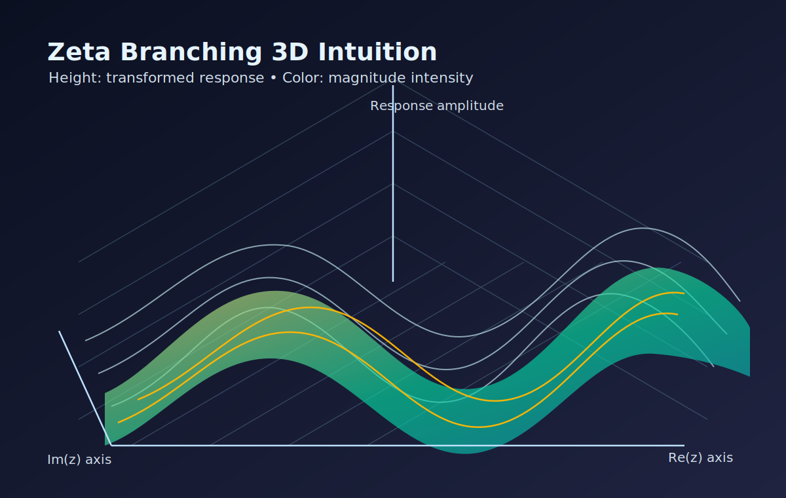

# Zeta Branching Project

This repository explores recursive complex-domain transformations based on a zeta-inspired kernel, and includes a learned surrogate model for faster plotting and parameter sweeps.

## 3D intuition

The visual below gives a quick intuition for how the transformed complex response can be interpreted as a surface over the complex plane:



- Horizontal plane: input complex plane coordinates `(Re(z), Im(z))`
- Surface height: transformed response level
- Surface color: response magnitude intensity

## Folder layout

- `scripts/`: all Python source scripts
  - `zeta_branching.py`: baseline recursive kernel and plot generation
  - `zeta_surrogate.py`: surrogate training and validation for `(alpha, cut_angle)`
  - `branched_mp4_zeta.py`: extended surrogate with `gamma` and animation support
- `models/`: trained model checkpoints and cached datasets
  - `.pt` files: PyTorch model checkpoints
  - `.npz` files: cached generated datasets
- `outputs/`: generated visual artifacts
  - `.png`: sweep and validation figures
  - `.gif` / `.mp4`: animations

## What each script does

### `scripts/zeta_branching.py`
- Computes recursive zeta-branch transforms directly (ground truth behavior).
- Produces depth, alpha, and branch-cut sweep plots.
- Saves figures into `outputs/`.

### `scripts/zeta_surrogate.py`
- Builds training data from the recursive kernel.
- Trains an MLP surrogate to predict transformed complex outputs quickly.
- Loads/saves model and dataset in `models/`.
- Saves validation and sweep plots into `outputs/`.

### `scripts/branched_mp4_zeta.py`
- Adds `gamma` as an extra control parameter.
- Trains/loads a richer surrogate model.
- Can generate validation plots and cut-angle/alpha sweep animations.
- Reads/writes model data in `models/` and media in `outputs/`.

## Typical usage

Run from the repository root:

```powershell
python scripts/zeta_branching.py
```

```powershell
python scripts/zeta_surrogate.py
```

```powershell
python scripts/branched_mp4_zeta.py --frames 60 --param cut_angle
```

Optional examples:

```powershell
python scripts/branched_mp4_zeta.py --skip-validation
python scripts/branched_mp4_zeta.py --param alpha --frames 80
python scripts/branched_mp4_zeta.py --retrain
```

## Notes

- Existing generated artifacts were moved into `models/` and `outputs/`.
- Scripts were updated to use project-root-relative paths, so they keep working after the reorganization.
- If `ffmpeg` is unavailable, animation export falls back to GIF when possible.
